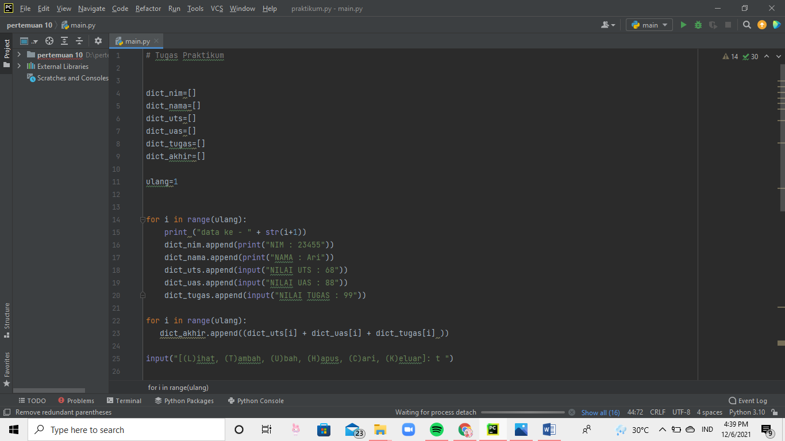
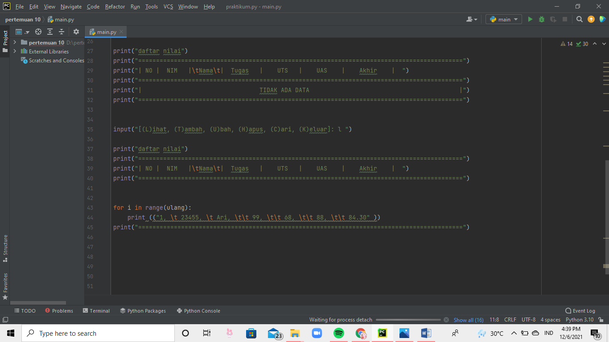
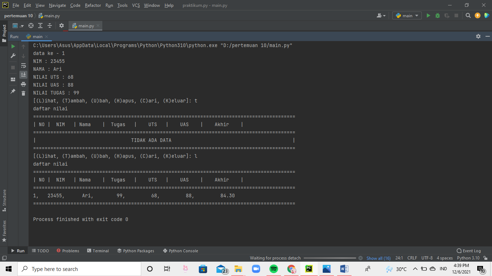

# tugas10

## Pengertian
Dictionaries adalah koleksi pasangan item-item berasosiasi dimana
setiap pasangan terdiri dari suatu key dan value. 

pertama-tama masukan code pemrograman seperti dibawah ini 

ini lanjutannya 

## dan hasil outputnya jadi seperti ini 

